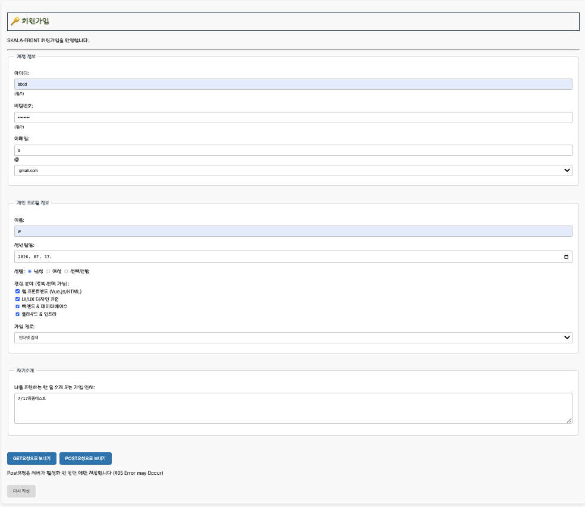
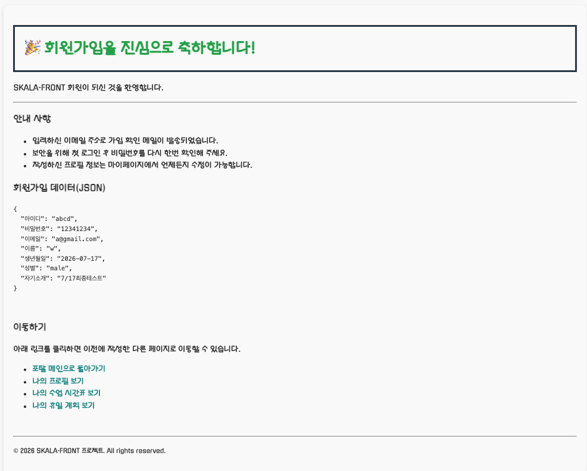

# SKALA 4th - GJ 1주차 보고서

## 1. 디렉토리 구성
- **/html, /css, /script, /media**: 기본 과제 파일 포함  
- **/fastAPI**: main.py 및 requirements.txt 포함  
- **/venv**: FastAPI 및 Python 가상환경  
- **.gitignore**: pycache, DS store 제외 목적  
- **/report_images**: README.md 보고서 작성 용도

### /html/index.html 에서 vscode 'Go Live' 직접 실행시에도 문제 없이 실행 가능

## 2. FastAPI 사용 이유
- VSCode Live Server(Go Live) 환경에서 **405 Method not allowed** 발생  
- Go Live는 CRUD 중 **Read만 지원** → Post 테스트 불가  
- Post 예제 구현을 위해 FastAPI 가상환경 구축 및 사용  
- 관련 패키지는 `/fastAPI/requirements.txt`에서 확인 가능  

### POST 사용 화면은다음과 같다
-포스트 폼 작성(Try)

-포스트 폼 결과(signUpResultPost.html with jinja2)



## 3. fastAPI: 해결한 어려움 - 경로설정의 디테일
- 기존 Go Live 정적 파일 경로 유지 위해 **app.mount()** 활용함
- fastApi 작동 시 **프로젝트 최상위 디렉토리에서 실행 권장**
- fastApi 사용시 Media 파일은 mount하지 않아 이미지 출력 불가(확장자 통일이 안되어있어 패스)
- 단, **Tetris(HTML/CSS/JS)** 및 **날씨 모듈(API 기반)** 정상 작동  

## 4. GET과 POST 구성
- 버튼으로 요청 방식 구분함
- form method와 form action 등 html Attribute를 이용해 덮어쓰는 방식을 사용함
- 중요 코드:
  ```html
  <form action="/html/signUpResult.html" method="get">
    <input type="submit" class="btn-submit" value="GET요청으로 보내기">
    <input type="submit" class="btn-submit" value="POST요청으로 보내기" 
           formmethod="post" formaction="/signUpResultPost">
    <p>Post요청은 <strong>서버 활성화 시</strong>에만 작동합니다</p>
  </form>'''

woosm901@gmail.com / white-spade@naver.com
<br>Or SKALA 내부 DM 연락 가능